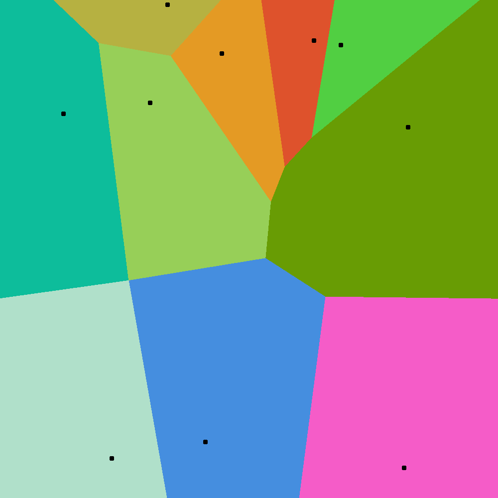
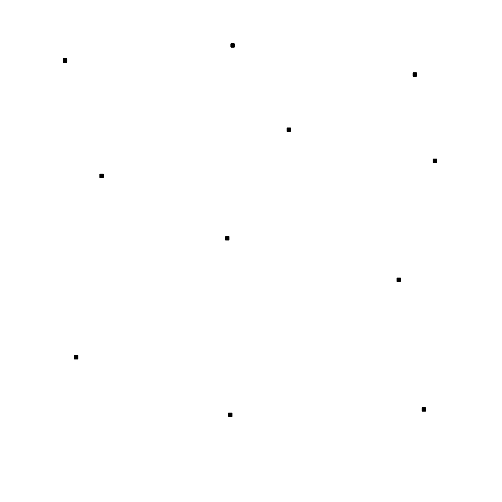
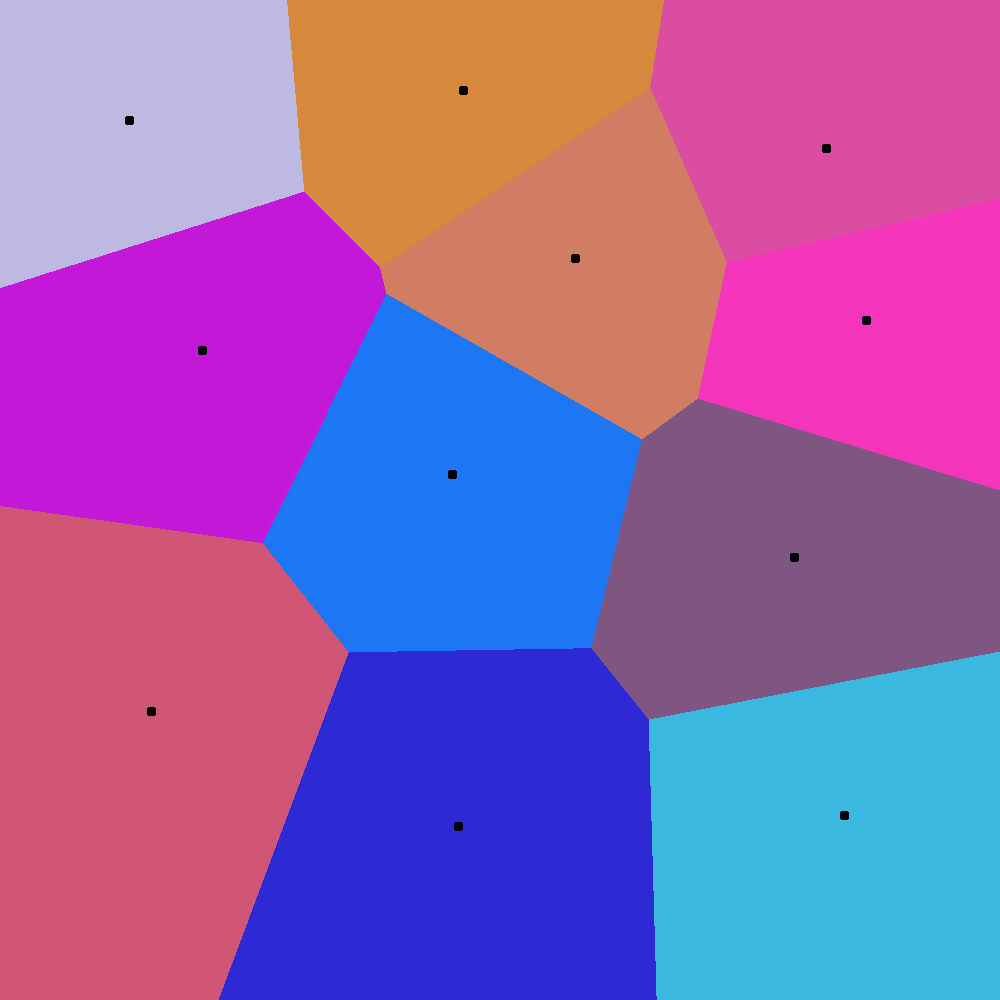

# voronoi-sdl

A Voronoi diagram implementation using C++ and the SDL library.

<p align="center">
    
</p>

## Running

To build and run the project, simply run

```bash
./build.sh
```

Note that, if your window manager isn't BSPWM, you can remove the line indicated in the `build.sh` file, which is intended for BSPWM to launch the program's window in a floating state.

## Modes

Currently, there are two modes, the **random** mode and the **interactive** mode. In the random mode, centroids are generated randomly, whereas in the interactive mode, you can place your own centroids by left-clicking around the screen. After that, by pressing `Space`, the Voronoi diagram for the given centroids will be generated. Pressing space any further will simply keep on generating random diagrams like in the random mode.

<p align="center">
    
    
</p>

## Controlling the diagram

For now, only very simple controls have been implemented:

- `q`/`Q`/`Escape`: quit
- `Space`: re-render the diagram with new centroids and colors
- `i`/`I`: enter the interactive mode
